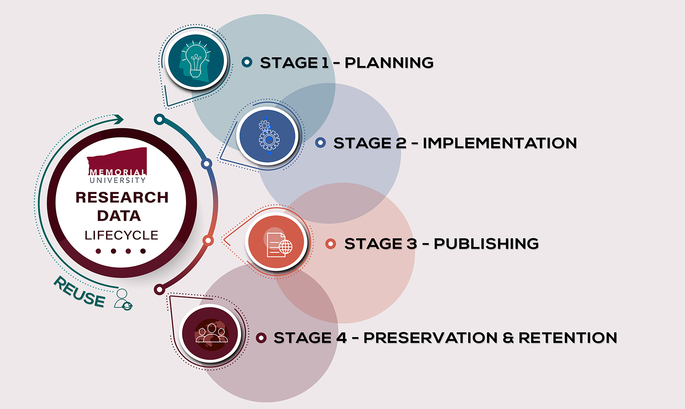
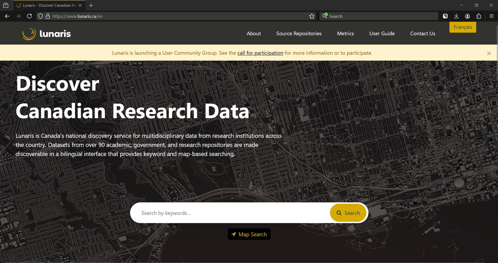

## Introduction

- Thanks to SSHRC for supporting this "Opening doors to data" project via the Connections Grant program: RDM stream
- Thanks to CRDCN and its funders: CFI, CIHR, SSHRC, Provincial Partners and Collaborating Institutions. 

Please access the project folder for this workshop: www.github.com/CRDCN/RAD_training

## Introduction

-   Evolution of data discovery & open science
-   Journal pressures
-   Council pressures
-   University pressures

## Containing this

-   Today we're talking about restricted access data
-   Not all sensitive data, and not open data, but data that have an access process or mechanism

## Targets

-   FAIR data
-   "As open as possible, as closed as necessary"
-   This is not a binary, but a continuum

## Data lifecycle

-   Image of data lifecycle & description (credit: Memorial University OVPR) 

## Researcher support for discoverability

F - [_Findable_](https://faircookbook.elixir-europe.org/content/recipes/findability.html)

## Researcher support for discoverability

F - [_Findable_](https://faircookbook.elixir-europe.org/content/recipes/findability.html)

Can anyone discover that your data even exist? 

Can others even figure out where the data you used are?

Concepts:

-   Persistent Identifiers
-   Indexing (including metadata)

## Researcher support for discoverability

A - [_Accessible_](https://faircookbook.elixir-europe.org/content/recipes/accessibility.html)

## Researcher support for discoverability

A - [_Accessible_](https://faircookbook.elixir-europe.org/content/recipes/accessibility.html)

Can others access the data you used?

Can they figure out HOW to do so?

Concepts:

-   Data accessibility statement
-   Access metadata
-   Transparent process

## Researcher support for discoverability

I - [_Interoperable_](https://faircookbook.elixir-europe.org/content/recipes/interoperability.html)

## Researcher support for discoverability

I - [_Interoperable_](https://faircookbook.elixir-europe.org/content/recipes/interoperability.html)

Concepts:

-   Open source
-   Machine-readable
-   Metadata
-   Control vocabularies

## Researcher support for discoverability

R - [_Reusable_](https://faircookbook.elixir-europe.org/content/recipes/reusability.html)

## Researcher support for discoverability

R - [_Reusable_](https://faircookbook.elixir-europe.org/content/recipes/reusability.html)

Concepts:

-   Provenance
-   Licensing
-   Archiving

## Case study: CBS

-   Canadian Blood Services offers secondary use research data (that is, databases about donors that you can request)
-   Suppose you were a researcher interested in research on data about donors

1.  Think about a research question and evaluate whether you could answer it
2.  Outline the process you would follow to get the data

-   We'll take up these questions and discuss how "FAIR" we think the data are.

## Case study: CBS

-   Canadian Blood Services offers secondary use research data (that is databases about donors that you can request)
-   Suppose you were a researcher interested in research on data about donors

1.  Think about a research question and evaluate whether you could answer it
2.  Outline the process you would follow to get the data

## Takeup (GA)

## FAIR Restricted data

-   Findability doesn't **need** to be affected, but often is
-   Accessibility might mean something different
-   Interoperability can sometimes be tricky
-   Reusability can be better, but this requires effort

## Findability

-   Organizations providing data as a non-priority activity
-   Resources to make it findable may not even be considered
-   Knowledge of how to make data discoverable might not exist
-   Even where a core dataset from an academic source exists there can be
    a.  A research team primarily using the data and making it available is secondary (see item 1)
    b.  Because it isn't open, it's not posted, and making it findable is a separate activity (where with open data it's often put into a service that manages both curation and discoverability)

## Accessibility

-   Is it even considered?
    -   I would argue yes, very seriously, but not with a lens of FAIR
    -   Some of this is foundational see [_Read et al. 2024_](https://doi.org/10.7191/jeslib.907)

## Interoperability

-   This goes hand-in-hand with findability and suffers the same resourcing issue
-   Metadata can have the potential to disclose individuals
-   Restricted datasets [_don't generally have good metadata_](https://doi.org/10.1139/facets-2023-0102)

## Reusability

-   Data often belong to an organization and so don't suffer the same risks that data held by individuals do
-   Similar to Interoperability/Findability issues though, improper data management makes data less reusable

## What would success look like? (GA)

## Data management planning

-   [_DMP template tool_](https://dmp-pgd.ca/)
    -   Consider what anyone following on from you will be starting from. Everything that got you from that step to another point becomes part of your research data
    -   Not every part of the project data will therefore be restricted and you need to plan for that

## Data Accessibility Statements

-   "Access available on request" NOT sufficient
-   Encourage data source to template this language! If no, DIY with review

## Data Accessibility Statement Contents

## Data Accessibility Statement Contents

-   Who can access
    -   Rank?
    -   Research themes?
    -   Citizenship?
-   Terms of access
    -   Consultation?
    -   Ethics?
    -   Proposal?
    -   Citation?
    -   TRE?
-   Licensing/Agreements
    -   Ex. CC-BY vs. CC-BY-NC
-   Costs

## Data Accessibility Statements

-   Thorough description of the access process, eligibility requirements links to info, financing considerations, and licensing info/terms-of-use

## Data discovery efforts

-   Any datasource can now be indexed in Lunaris relatively easily.
-   Metadata only deposits where there is some info to provide to potential users.
-   Metadata only deposits also create a PID (persistent identifier) which makes the data a lot easier to find for someone who wants to use it in the future because [_YOU CAN CITE IT_](https://guides.library.oregonstate.edu/research-data-services/data-management-data-citation)

## Preservation efforts

-   If a datasource overwrites my data with a new copy and doesn't say anything then someone trying to recreate my work will be very confused at best
-   Ideally new versions get new PIDs and older versions point to the newest, or everything is gathered under one PID with versioning.
-   Frequency of versioning will depend on frequency of access and preferences of organizations.

## How do I talk to my data source?

-   Raise the issue
-   Highlight the benefits
-   Point to resources

## Case study; indexing in Lunaris

-   Lunaris is a service of the Digital Research Alliance of Canada
-   It collates metadata from a variety of sources
-   Data sources can work with Lunaris to have their datasets indexed

## Lunaris page

## System needs

-   Lunaris has a metadata schema (list of information it can process and display)
-   Any data source can provide a database of this information about their datasets to be "harvested"
-   Work with Lunaris team to determine how the data should be formatted (samples from our case study in the workshop folder)

## Case study

## Case study

## Case study

## Step 1: Metadata crosswalk

-   Sounds fancier than it is
-   Map fields from my database to the schema from Lunaris
-   In some cases these will be dynamic and obvious (ex. "Database name")
    -   Some will be dynamic and non-obvious
-   In some cases these will be static and need to be generated (ex. "Rights")

## Crosswalk examples
- Subjects + Static fields -> Keywords
- Static access data -> Rights
- Permalink (on crdcn.ca) -> URL
- Catalogue ID -> Identifier

## Step 2: Translation code

-   Example in the resources (.py and .R) for our translations
-   Dynamic fields mapped against the current database
-   Static fields added at the end
-   If you have EN/FR metadata both can be included in one file
-   Write output as .json file

## Step 3: Publish

-   Post the .json file somewhere (anywhere) accessible on the web and share this with the Lunaris team
-   Updates made to the file will be automatically reflected in Lunaris ("Harvester" checks back on occasion)

## Result

-   Restricted dataset is much more discoverable to those seeking information on a given topic
-   Updates to metadata including access protocols, dataset info, even new data available are machine readable

## Result

[_Lunaris example page_](https://www.lunaris.ca/catalog/02f94897-9129-5cfa-82d7-1a4491704b93?locale=en&q=&sort=dc_date+desc%2C+dc_title_multi+asc&f%5Bfrdr_origin_id%5D%5B%5D=City+of+Edmonton+Open+Data+Portal&f%5Bdc_date%5D%5B%5D=2025-03-18to2025-06-16)

## Option 2 - Metadata only deposits

-   More detailed and of greater use to others
-   Create similar metadata profile to previous example
-   BUT, can include documentation

## Introducing: Borealis

-   National collection of Dataverse instances (one from *most* Canadian universities)
-   Your dataverse ingests data, Borealis rolls it up into a national service
-   Borealis info is collected by other search tools (including Lunaris).
- [_Example_](https://demo.borealisdata.ca/dataset.xhtml?persistentId=doi%3A10.80240%2FFK2%2FDTCL3Z&version=DRAFT)

## Borealis & restricted data

-   Can't deposit personally identifiable info into Borealis
-   CAN create metadata records including deposit of supporting documents
-   With the right supporting documents, Borealis can be a very effective tool for data discovery
    -   Anonymized version of dataset
    -   Questionnaires
    -   Structural files

## Borealis & restricted data

-   Metadata only \< Metadata w summary docs \< Metadata with variable-level information
-   Resource document and explainer available

## Why choose Borealis or Lunaris

Lunaris Pros:

-   Dynamic updates to content 'automatic'
-   Minimal lift to create a series of entries from existing data

Borealis Pros:

-   Permits a greater level of detail about the resource
-   Allows document upload
-   Creates a permanent landing page for the resource
-   Mints a DOI for the resource which is 'versioned'

## Why choose Borealis or Lunaris

Lunaris Cons:

-   Limited and inflexible info about data source
-   Needs a landing page to point to
-   No "permanence" to the record, nothing is created to cite or point to
-   System needs some data skill to populate automatically/navigate

Borealis Cons:

-   Process to create/update records more involved
-   Many fields to populate (though most are optional)
-   Records cannot be deleted (this is also a pro!)
-   Accessibility (for upload) limited to consortia members

## When to use Lunaris

- Pre-existing and established set of landing pages
- No additional documentation to upload
- Frequent changes/additions/updates *that don't reflect changes to the underlying data*
- Data provider is not a consortium member

## When to use Borealis

- Want to create a PID for the dataset
- Have additional contextual info to provide (ex. PDF uploads, more thorough metadata)

## Thank you for your attention

- Questions?

- grant.gibson@crdcn.ca
