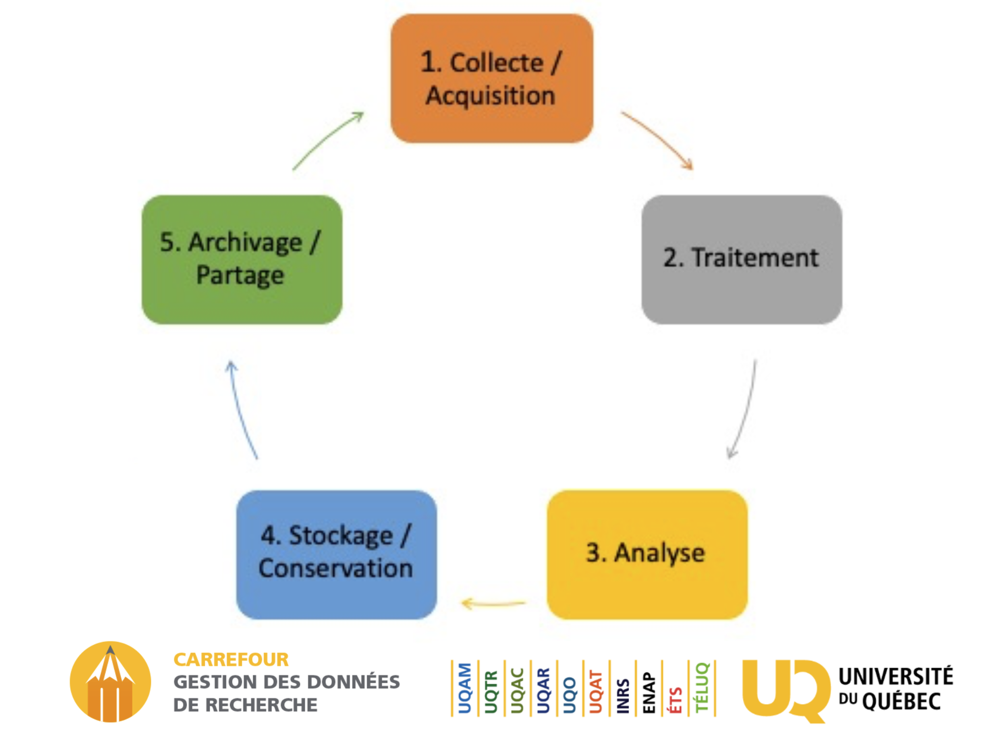
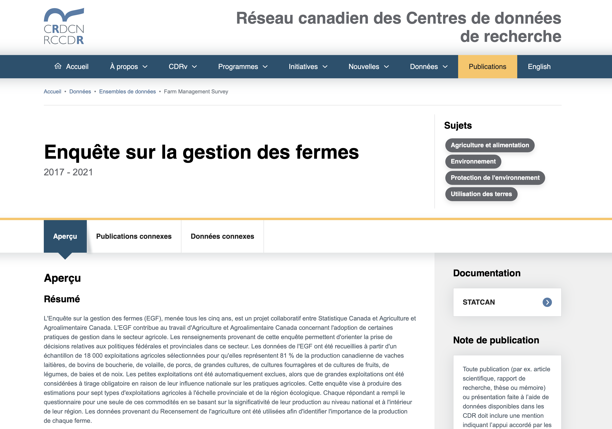
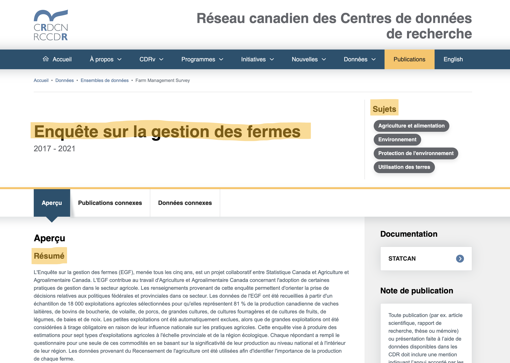

## Introduction

- Merci au CRSH pour son soutien au projet « Portes ouvertes aux données » dans le cadre du programme Connexion, volet GDR. 
- Merci aussi au RCCDR et à ses bailleurs de fonds : la FCI, les IRSC, le CRSH, les partenaires provinciaux et les institutions collaboratrices.
- Finalement, merci au CIQSS pour sa participation

Veuillez accéder au dossier du projet pour cet atelier : www.github.com/CRDCN/RAD_training 

## Introduction

- Évolution de la découvrabilité des données et de la science ouverte 
- Pressions exercées pas les revues scientifiques 
- Pressions exercées par les conseils 
- Pressions au sein des universités 

## Pour contenir la séance

- Aujourd’hui, nous parlons des données à accès restreint
- Il ne s’agit pas de toutes les données sensibles, ni de données ouvertes, mais de données assorties d’un processus ou d’un mécanisme d’accès

## Objectifs

- Données FAIR 
- « Aussi ouvertes que possible, aussi fermées que nécessaire » 
- Ce n’est pas un choix binaire, mais un continuum 

## Contibutions des chercheurs à FAIR

F - [_Faciles à retrouver_](https://faircookbook.elixir-europe.org/content/recipes/findability.html) - (Findable)

## Contibutions des chercheurs à FAIR

F - [_Faciles à retrouver_](https://faircookbook.elixir-europe.org/content/recipes/findability.html)

Est-ce que quiconque peut découvrir vos données et savoir qu’elles existent? 

D’autres personnes peuvent-elles déterminer où se trouvent les données que vous avez utilisées? 

Concepts : 

- Identifiants pérennes (PID) 
- Indexation (y compris les métadonnées)

## Contibutions des chercheurs à FAIR

A - [_Accessibles_](https://faircookbook.elixir-europe.org/content/recipes/accessibility.html) (Accessible)

## Contibutions des chercheurs à FAIR

A - [_Accessibles_](https://faircookbook.elixir-europe.org/content/recipes/accessibility.html)

D’autres personnes peuvent-elles accéder aux données que vous avez utilisées ? 

Savent-elles comment y accéder ? 

- Déclaration d’accessibilité des données 
- Métadonnées d’accès 
- Processus clair et transparent 

## Contibutions des chercheurs à FAIR

I - [_Interopérables_](https://faircookbook.elixir-europe.org/content/recipes/interoperability.html) (Interoperable)

## Contibutions des chercheurs à FAIR

I - [_Interopérables_](https://faircookbook.elixir-europe.org/content/recipes/interoperability.html)

Concepts : 

- Code source ouvert
- Lisible par machine 
- Métadonnées 
- Vocabulaires contrôlés 

## Contibutions des chercheurs à FAIR

R - [_Réutilisables_](https://faircookbook.elixir-europe.org/content/recipes/reusability.html) (Reusable)

## Contibutions des chercheurs à FAIR

R - [_Réutilisables_](https://faircookbook.elixir-europe.org/content/recipes/reusability.html)

Concepts : 

- Provenance 
- Licence 
- Archivage 

## Data lifecycle

-   Gestion de données de recherche (Université du Québec) 

## Étude de cas : SCS

- La Société canadienne du sang offre des données de recherche à usage secondaire (c’est-à-dire des bases de données sur les donneurs que vous pouvez demander). 

Supposons que vous ayez un intérêt pour la recherche sur des données relatives aux donneurs. 

À partir des informations accessibles en ligne : 

1. Réfléchissez à une question de recherche et évaluez si vous pourriez y répondre. 
2. Décrivez le processus que vous suivriez pour obtenir les données. 

Nous reviendrons sur ces questions et verrons dans quelle mesure les données sont FAIR 

## Étude de cas : SCS

Supposons que vous ayez un intérêt pour la recherche sur des données relatives aux donneurs. 

À partir des informations accessibles en ligne : 

1. Réfléchissez à une question de recherche et évaluez si vous pourriez y répondre. 

2. Décrivez le processus que vous suivriez pour obtenir les données. 

 

## Discussion

## Données restreintes FAIR

- *F*aciles à retrouver : La découvrabilité n’a pas **nécessairement** besoin d’être affectée, mais elle l’est souvent
- L’*A*ccessibilité a souvent une signification différente  
- L’*I*nteropérabilité peut parfois poser des problèmes 
- La *R*éutilisabilité peut être mieux que d'ailleurs, mais cela demande des efforts 

## Faciles à retrouver

- Organisations offrant des données comme activité non prioritaire 
- Les ressources pour les rendre trouvables peuvent ne même pas être envisagées 
- Le savoir-faire pour rendre les données découvrables peut être inexistant 

## Faciles à retrouver
- Même lorsqu’un ensemble de données provenant d’une source universitaire existe, il peut y avoir : 

  a. Une équipe de recherche qui utilise les données de leur côté, leur mise à disposition étant secondaire (voir point 1) 

  b. Comme les données ne sont pas ouvertes, elles ne sont pas publiées, et les rendre trouvables demande une activité distincte (alors que pour les données ouvertes, elles sont souvent intégrées à un service qui assure à la fois leur curation et leur découvrabilité) 

## Accessibles

- Est-ce même considéré ? 
- Je dirais que oui, très sérieusement, mais pas dans une optique FAIR  
- Une partie de cela est fondamentale - voir [_Read et al. 2024_](https://doi.org/10.7191/jeslib.907) 

## Intéroperables

- Cela va de pair avec la découvrabilité et souffre du même problème de ressources. 
- Les métadonnées peuvent potentiellement révéler l’identité des individus. 
- Les ensembles de données restreints [n’ont généralement pas de bonnes métadonnées](https://doi.org/10.1139/facets-2023-0102) 

## Réutilsables

- Les données appartiennent souvent à une organisation et ne présentent donc pas les mêmes risques que celles détenues par des individus. 
- Comme pour les problèmes d’interopérabilité et de découvrabilité, une mauvaise gestion des données réduit leur réutilisabilité. 

## À quoi ressemble le succès ?

## Planification de la gestion des données

[_PGD outil de gestion_](https://dmp-pgd.ca/) 

- Pensez à ce qui sera nécessaire à toute personne qui reprendra votre travail. Tout ce qui vous a permis de progresser d'une étape à l'autre fait partie de vos données de recherche. 
- Toutes les données du projet ne seront donc pas restreintes, et il est important d’en tenir compte dans votre planification. 

## Déclarations d’accessibilité des données

- La mention « Accès disponible sur demande » n’est PAS suffisante 
- Encourager la source des données à fournir un modèle pour ce type de formulation ! Sinon, créez-le vous-même et faites-le réviser 

## Contenu à inclure dans une déclaration d’accessibilité des données  

 

## Contenu à inclure dans une déclaration d’accessibilité des données  

- Qui peut y accéder 
  a. Fonction (rang) ? 
  b. Thèmes de recherche ? 
  c. Citoyenneté ? 
- Conditions d’accès 
  a. Consultation ? 
  b. Éthique ? 
  c. Proposition de recherche ? 
  d. Citation ? 
  e. TRE-ERS(Trusted Research Environment / environnement de recherche sécurisé) ?
  f. Coûts
<<<<<<< HEAD:présentation.rmd
- Types de licences / ententes - Ex. CC-BY (Creative Commons – Avec attribution) vs. CC-BY-NC (Creative Commons – Avec attribution – Sans utilisation commerciale) 
=======
  
## En plus  
- Types de licences / ententes 
  - Ex. CC-BY (Creative Commons – Avec attribution) vs. CC-BY-NC (Creative Commons – Avec attribution – Sans utilisation commerciale) 

## Déclaration d’accessibilité des données

- Description détaillée du processus d’accès, des critères d’admissibilité, avec liens vers l’information, considérations financières et renseignements sur la licence ou les conditions d’utilisation. 

## Efforts de découverte des données

- Toute source de données peut désormais être indexée relativement facilement dans Lunaris. 
- Dépôts réservés aux métadonnées lorsqu’il y a des informations à fournir aux utilisateurs potentiels. 
- Les dépôts réservés aux métadonnées créent également un identifiant persistant (PID), ce qui rend les données beaucoup plus faciles à trouver pour quelqu’un qui souhaite les utiliser ultérieurement, car [_VOUS POUVEZ LES CITER_](https://guides.library.oregonstate.edu/research-data-services/data-management-data-citation) 

## Efforts de préservation

- Si une source de données écrase mes données avec une nouvelle copie sans l’indiquer, toute personne cherchant à reproduire mon travail sera au mieux très confuse. 
- Idéalement, les nouvelles versions devraient avoir de nouveaux identifiants persistants (PID), et les anciennes versions devraient renvoyer vers la plus récente, ou bien, tout devrait être regroupé sous un seul PID avec une gestion des versions. 
- La fréquence de suivi des versions dépendra de la fréquence d’accès et des préférences des organisations.

## Comment en discuter avec la source de mes données ?

- Soulever la question 
- Mettre en évidence les avantages de recourir à de telles pratiques 
- Diriger vers les ressources disponibles 

## Étude de cas : indexation dans Lunaris

- Lunaris est un service de l’Alliance de recherche numérique du Canada 
- Ce service regroupe les métadonnées provenant de diverses sources 
- Les fournisseurs de données peuvent collaborer avec Lunaris pour faire indexer leurs ensembles de données 

## Lunaris page

## Exigences du système

- Lunaris dispose d’un schéma de métadonnées (liste des informations qu’il peut traiter et afficher). 
- Toute source de données peut fournir une base de données contenant ces informations sur ses jeux de données pour qu’elles soient « moissonnées ». 
- Collaborer avec l’équipe de Lunaris pour déterminer le format des données (exemples issus de notre étude de cas disponibles dans le dossier de l’atelier). 

## Étude de cas

## Étude de cas

## Étude de cas

## Étape 1 : Correspondance des métadonnées

- Plus simple qu’il n’y paraît  
- Faire correspondre les champs de ma base de données avec le schéma de Lunaris 
- Dans certains cas, ces champs seront dynamique et seront faciles à repérer (ex. "Nom de la base de données").  
  - Certains seront dynamiques et moins évidents. 
- Dans certains cas, ils seront statiques et devront être créés manuellement (ex. "License"). 

## Exemples de correspondances 
- Sujets + champs statiques -> Mots-clés
- Paramètres d'accès (statique) -> License
- Lien permanent (crdcn.ca) -> URL
- Identifiant du catalogue -> Identifiant

## Étape 2 : Code de traduction

- Exemple dans les ressources (.py et .R) pour nos traductions 
- Champs dynamiques mis en correspondance avec la base de données actuelle 
- Champs statiques ajoutés à la fin 
- Si vous avez des métadonnées EN/FR, les deux devraient figurer dans un seul fichier 
- La sortie écrit dans un fichier .json 

## Étape 3 : Publication

- Publiez le fichier .json à un endroit accessible sur le web (n’importe où) et partagez-le avec l’équipe de Lunaris. 
- Les mises à jour apportées au fichier se réflèteront automatiquement dans Lunaris (l’outil de collecte « harvester » revérifie périodiquement). 

## Résultat

- Un ensemble de données restreint devient beaucoup plus facile à repérer pour celles et ceux qui recherchent de l’information sur un sujet donné. 
- Les mises à jour des métadonnées, y compris les protocoles d’accès, les informations sur l’ensemble de données et même les nouvelles données disponibles, sont interprétables par un système informatique. 

## Résultat

[_Example_](https://test.lunaris.ca/catalog/87dc478c-8d31-5d5f-8394-ce8c8d5f9448?locale=fr&q=&f%5Bfrdr_origin_id%5D%5B%5D=CRDCN)

## Option 2 – Dépôts de métadonnées

- Plus détaillés et plus utiles pour les autres 
- Génèrent un profil de métadonnées similaire à l’exemple précédent 
- MAIS, ils peuvent inclure de la documentation 

## Présentation : Boréalis

- Ensemble national d’instances Dataverse (provenant de la plupart des universités canadiennes) 
- Votre Dataverse intègre les données, et Boréalis les regroupe dans un service national 
- Les informations de Boréalis sont collectées par d’autres outils de recherche (y compris Lunaris) 
- [_Exemple_](https://demo.borealisdata.ca/dataset.xhtml?persistentId=doi%3A10.80240%2FFK2%2FDTCL3Z&version=DRAFT)

## Boréalis et données à accès restreint

- Il n'est pas permis de déposer dans Boréalis des renseignements identifiables
- Il est toutefois possible de créer des fiches de métadonnées, incluant le dépôt de documents d’accompagnement
- Avec les bons documents d’accompagnement, Boréalis peut devenir un outil très efficace pour la découverte de données :
  - Version anonymisée des bases de données
  - Questionnaires
  - Fichiers structurels

## Boréalis et données à accès restreint

- Métadonnées seules < Métadonnées avec documents sommaires < Métadonnées avec information au niveau des variables 
- Un document de référence et un guide explicatif sont disponibles 

## Pourquoi choisir Boréalis vs Lunaris

Avantages de Lunaris : 

- Mises à jour du contenu dynamiques et automatiques 
- Effort minimal pour créer une série d’entrées à partir de données existantes 

Avantages de Boréalis : 

- Offre un niveau de détail accru sur la ressource 
- Autorise le dépôt de documents 
- Crée une page de destination permanente pour la ressource 
- Attribue un DOI à la ressource, assorti d’un suivi des versions 

## Pourquoi choisir Boréalis vs Lunaris

Lunaris – Inconvénients 

- Informations limitées et peu flexibles sur la source des données 
- Nécessite une page de renvoi vers laquelle diriger les gens qui veulent consulter l’information 
- Aucune permanence du dossier : rien n’est créé pour être cité ou référencé 
- Le système exige certaines compétences techniques pour alimenter ou naviguer automatiquement 

##  Pourquoi choisir Boréalis vs Lunaris

Boréalis – Inconvénients 

- Processus de création ou de mise à jour des fiches est plus complexe 
- De nombreux champs à remplir (même si la plupart sont facultatifs) 
- Les fiches ne peuvent pas être supprimées (ce qui peut aussi être un avantage) 
- L’accès pour téléverser est réservé aux membres du consortium

## Quand utiliser Lunaris

- Série de pages de destination préexistantes et établies 
- Aucune documentation supplémentaire à téléverser 
- Modifications, ajouts ou mises à jour fréquents qui ne reflètent pas de changements dans les données sous-jacentes 
- Fournisseur de données qui n’est pas membre du consortium 

## Quand utiliser Boréalis

- Vous souhaitez attribuer un identifiant pérenne (PID) à l’ensemble de données 
- Vous avez des informations contextuelles supplémentaires à fournir (ex. : téléversement de fichiers PDF, métadonnées plus détaillées)

## Merci de votre attention

- Questions ?

- grant.gibson@crdcn.ca
